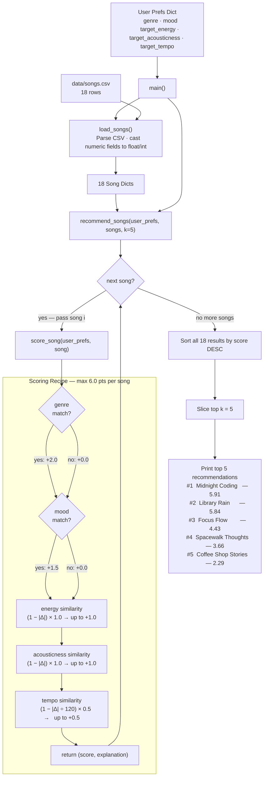

# 🎵 Music Recommender Simulation

## Project Summary

In this project you will build and explain a small music recommender system.

Your goal is to:

- Represent songs and a user "taste profile" as data
- Design a scoring rule that turns that data into recommendations
- Evaluate what your system gets right and wrong
- Reflect on how this mirrors real world AI recommenders

Replace this paragraph with your own summary of what your version does.

---

## How The System Works

Real-world music recommendation systems, like those on Spotify or YouTube, combine collaborative filtering (analyzing what similar users like based on shared behavior such as likes, skips, and playlists) with content-based filtering (matching songs to user preferences using attributes like tempo, mood, energy, and genre). They often incorporate machine learning models trained on vast datasets to predict preferences, balancing personalization with diversity to avoid echo chambers. My version prioritizes a simple content-based approach, focusing on numerical song features (energy, valence, tempo_bpm, danceability, acousticness) for vibe matching, with categorical boosts for genre and mood, to simulate how platforms recommend based on musical attributes while keeping the system transparent and easy to understand.

### Song Object Features
The `Song` class uses the following features from the `songs.csv` dataset:
- `id` (int): Unique identifier for the song.
- `title` (str): Song title.
- `artist` (str): Artist name.
- `genre` (str): Categorical genre (e.g., pop, lofi, rock).
- `mood` (str): Categorical mood (e.g., happy, chill, intense).
- `energy` (float): Numerical value (0-1) indicating intensity/excitement.
- `tempo_bpm` (float): Beats per minute, measuring pace.
- `valence` (float): Numerical value (0-1) indicating positivity/happiness.
- `danceability` (float): Numerical value (0-1) indicating suitability for dancing.
- `acousticness` (float): Numerical value (0-1) indicating acoustic vs. electronic elements.

### UserProfile Object Features
The `UserProfile` class stores user preferences to match against songs:
- `favorite_genre` (str): User's preferred genre (e.g., pop, lofi).
- `favorite_mood` (str): User's preferred mood (e.g., happy, chill).
- `target_energy` (float): User's preferred energy level (0-1).
- `likes_acoustic` (bool): Whether the user prefers acoustic songs (True/False).

These features enable content-based filtering, where numerical attributes are compared for similarity (e.g., minimizing distance in energy), and categorical ones provide bonus points for exact matches. The system prioritizes vibe alignment over other factors like popularity or user history.

### Data Flow

The diagram below traces how a single song travels from the CSV file to a ranked recommendation slot.



**How to read the diagram:**
- **Left column** — inputs: the user's taste profile and the raw CSV file enter through `main()`.
- **`load_songs()`** — reads every CSV row and casts numeric fields so math operations work downstream.
- **Loop diamond** — `recommend_songs` calls `score_song` once for each of the 18 songs; the back-edge from `return` to the diamond represents that iteration.
- **Scoring Recipe subgraph** — the interior of `score_song`: two binary checks (genre, mood) followed by three continuous similarity calculations. A song that matches on every feature scores the full 6.0 pts.
- **Sort → Slice → Print** — after all 18 songs are scored, they are ranked highest-to-lowest and the top `k` are returned and printed.

---

### Algorithm Recipe

Every song is evaluated by `score_song()` using this fixed point table. Scores are summed, then all 18 songs are ranked highest-to-lowest and the top `k` are returned.

| Feature | Points | Method | Why this weight |
|---|---|---|---|
| Genre match | **+2.0** | Binary (exact string) | 14 unique genres — the most specific signal in the dataset |
| Mood match | **+1.5** | Binary (exact string) | 12 moods, but moods cross genre lines (e.g. "chill" = lofi AND ambient AND jazz), so slightly less decisive than genre |
| Energy similarity | **0 – +1.0** | `(1 − \|song − target\|) × 1.0` | Continuous 0–1 scale; largest behavioral separator after genre/mood |
| Acousticness similarity | **0 – +1.0** | `(1 − \|song − target\|) × 1.0` | Widest numeric gap in the dataset between opposing styles (rock ≈ 0.10, lofi ≈ 0.75) |
| Tempo similarity | **0 – +0.5** | `(1 − \|song − target\| ÷ 120) × 0.5` | Normalized by dataset BPM range (178 − 58 = 120); half-weighted because tempo correlates with energy and would otherwise double-count that signal |
| **Total possible** | **6.0 pts** | | |

**Example scores for the "chill lofi" profile:**

| Song | Genre | Mood | Energy | Acousticness | Tempo | Total |
|---|---|---|---|---|---|---|
| Midnight Coding | +2.0 | +1.5 | +0.96 | +0.96 | +0.49 | **5.91** |
| Storm Runner (rock) | +0 | +0 | +0.47 | +0.35 | +0.13 | **0.95** |

The 4.96-point gap between a lofi hit and a rock track shows the recipe cleanly separates opposing styles.

---

### Potential Biases

This system will behave unfairly or unexpectedly in the following predictable ways:

- **Genre dominates the ranking.** At +2.0 pts, a genre match is the single largest weight — larger than any continuous feature can contribute alone. A song in the right genre but with a mismatched vibe (e.g., an unusually intense lofi track) can outscore a song that nails energy, acousticness, and tempo but belongs to a different genre. Genre gatekeeps the top spots.

- **Culturally adjacent genres are penalized equally to unrelated ones.** Binary matching treats "hip-hop" and "r&b" as just as different from "lofi" as "metal" is. There is no partial credit for genres that share sonic qualities, so recommendations can feel narrowly literal.

- **Mood matches reward cross-genre outliers.** Because "chill" appears in lofi, ambient, and jazz, an ambient song can earn the full +1.5 mood bonus while still losing the +2.0 genre point — ending up mid-table even if it sounds nearly identical to the user's preferred songs.

- **Energy and tempo are correlated, so they partially double-penalize.** A song that is slightly too fast will lose points on both tempo similarity and energy similarity, even if only one of those dimensions truly matters to the user.

- **No diversity guarantee.** The ranker always returns the closest matches. A user who enjoys occasional variety will receive the same cluster of near-identical songs every run, with no mechanism to surface interesting edge cases.

---

### Terminal Output

Running `python -m src.main` produces the following output for two profiles.
The pop/happy profile verifies that pop songs rise to the top; the lofi/chill
profile is the primary taste profile for this project.

```
Loaded 18 songs from catalog.

==============================================================
  Music Recommender | Upbeat Pop (default verification profile)
==============================================================

  [1]  Sunrise City
        Artist : Neon Echo
        Genre  : pop  |  Mood: happy
        Score  : 5.99 / 6.0
        Why    :
                 + genre match (+2.0)
                 + mood match (+1.5)
                 + energy similarity (+1.00)
                 + acousticness similarity (+1.00)
                 + tempo similarity (+0.49)

  [2]  Gym Hero
        Artist : Max Pulse
        Genre  : pop  |  Mood: intense
        Score  : 4.21 / 6.0
        Why    :
                 + genre match (+2.0)
                 + energy similarity (+0.89)
                 + acousticness similarity (+0.87)
                 + tempo similarity (+0.45)

  [3]  Rooftop Lights
        Artist : Indigo Parade
        Genre  : indie pop  |  Mood: happy
        Score  : 3.75 / 6.0
        Why    :
                 + mood match (+1.5)
                 + energy similarity (+0.94)
                 + acousticness similarity (+0.83)
                 + tempo similarity (+0.48)

  [4]  Fuego en la Pista
        Artist : Ritmo Del Sur
        Genre  : latin  |  Mood: uplifting
        Score  : 2.37 / 6.0
        Why    :
                 + energy similarity (+0.94)
                 + acousticness similarity (+0.96)
                 + tempo similarity (+0.47)

  [5]  Night Drive Loop
        Artist : Neon Echo
        Genre  : synthwave  |  Mood: moody
        Score  : 2.35 / 6.0
        Why    :
                 + energy similarity (+0.93)
                 + acousticness similarity (+0.96)
                 + tempo similarity (+0.46)

--------------------------------------------------------------

==============================================================
  Music Recommender | Chill Lofi Study Session
==============================================================

  [1]  Midnight Coding
        Artist : LoRoom
        Genre  : lofi  |  Mood: chill
        Score  : 5.91 / 6.0
        Why    :
                 + genre match (+2.0)
                 + mood match (+1.5)
                 + energy similarity (+0.96)
                 + acousticness similarity (+0.96)
                 + tempo similarity (+0.49)

  [2]  Library Rain
        Artist : Paper Lanterns
        Genre  : lofi  |  Mood: chill
        Score  : 5.84 / 6.0
        Why    :
                 + genre match (+2.0)
                 + mood match (+1.5)
                 + energy similarity (+0.97)
                 + acousticness similarity (+0.89)
                 + tempo similarity (+0.48)

  [3]  Focus Flow
        Artist : LoRoom
        Genre  : lofi  |  Mood: focused
        Score  : 4.43 / 6.0
        Why    :
                 + genre match (+2.0)
                 + energy similarity (+0.98)
                 + acousticness similarity (+0.97)
                 + tempo similarity (+0.48)

  [4]  Spacewalk Thoughts
        Artist : Orbit Bloom
        Genre  : ambient  |  Mood: chill
        Score  : 3.66 / 6.0
        Why    :
                 + mood match (+1.5)
                 + energy similarity (+0.90)
                 + acousticness similarity (+0.83)
                 + tempo similarity (+0.43)

  [5]  Coffee Shop Stories
        Artist : Slow Stereo
        Genre  : jazz  |  Mood: relaxed
        Score  : 2.29 / 6.0
        Why    :
                 + energy similarity (+0.99)
                 + acousticness similarity (+0.86)
                 + tempo similarity (+0.44)

--------------------------------------------------------------
```

---

## Getting Started

### Setup

1. Create a virtual environment (optional but recommended):

   ```bash
   python -m venv .venv
   source .venv/bin/activate      # Mac or Linux
   .venv\Scripts\activate         # Windows

2. Install dependencies

```bash
pip install -r requirements.txt
```

3. Run the app:

```bash
python -m src.main
```

### Running Tests

Run the starter tests with:

```bash
pytest
```

You can add more tests in `tests/test_recommender.py`.

---

## Experiments You Tried

Use this section to document the experiments you ran. For example:

- What happened when you changed the weight on genre from 2.0 to 0.5
- What happened when you added tempo or valence to the score
- How did your system behave for different types of users

---

## Limitations and Risks

Summarize some limitations of your recommender.

Examples:

- It only works on a tiny catalog
- It does not understand lyrics or language
- It might over favor one genre or mood

You will go deeper on this in your model card.

---

## Reflection

Read and complete `model_card.md`:

[**Model Card**](model_card.md)

Write 1 to 2 paragraphs here about what you learned:

- about how recommenders turn data into predictions
- about where bias or unfairness could show up in systems like this


---

## 7. `model_card_template.md`

Combines reflection and model card framing from the Module 3 guidance. :contentReference[oaicite:2]{index=2}  

```markdown
# 🎧 Model Card - Music Recommender Simulation

## 1. Model Name

Give your recommender a name, for example:

> VibeFinder 1.0

---

## 2. Intended Use

- What is this system trying to do
- Who is it for

Example:

> This model suggests 3 to 5 songs from a small catalog based on a user's preferred genre, mood, and energy level. It is for classroom exploration only, not for real users.

---

## 3. How It Works (Short Explanation)

Describe your scoring logic in plain language.

- What features of each song does it consider
- What information about the user does it use
- How does it turn those into a number

Try to avoid code in this section, treat it like an explanation to a non programmer.

---

## 4. Data

Describe your dataset.

- How many songs are in `data/songs.csv`
- Did you add or remove any songs
- What kinds of genres or moods are represented
- Whose taste does this data mostly reflect

---

## 5. Strengths

Where does your recommender work well

You can think about:
- Situations where the top results "felt right"
- Particular user profiles it served well
- Simplicity or transparency benefits

---

## 6. Limitations and Bias

Where does your recommender struggle

Some prompts:
- Does it ignore some genres or moods
- Does it treat all users as if they have the same taste shape
- Is it biased toward high energy or one genre by default
- How could this be unfair if used in a real product

---

## 7. Evaluation

How did you check your system

Examples:
- You tried multiple user profiles and wrote down whether the results matched your expectations
- You compared your simulation to what a real app like Spotify or YouTube tends to recommend
- You wrote tests for your scoring logic

You do not need a numeric metric, but if you used one, explain what it measures.

---

## 8. Future Work

If you had more time, how would you improve this recommender

Examples:

- Add support for multiple users and "group vibe" recommendations
- Balance diversity of songs instead of always picking the closest match
- Use more features, like tempo ranges or lyric themes

---

## 9. Personal Reflection

A few sentences about what you learned:

- What surprised you about how your system behaved
- How did building this change how you think about real music recommenders
- Where do you think human judgment still matters, even if the model seems "smart"

